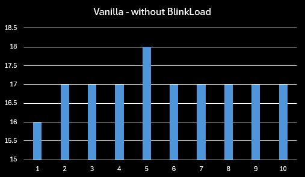

# BlinkLoad

Minecraft mod that caches assets to reduce game loading times.

## Benchmark

### Specifications

- CPU: Intel i7-9750H @ 3.1GHz
- 16GB RAM @ 2667MHz

### Mods

- [Fabric API](https://modrinth.com/mod/fabric-api)
- [Architectury API](https://modrinth.com/mod/architectury-api)
- [Mod Menu](https://modrinth.com/mod/modmenu)

### Results

Results may vary based on hardware (e.x. faster hardware may benefit less).

## Dependencies

### Required

- [Fabric API](https://modrinth.com/mod/fabric-api)
- [Architectury API](https://modrinth.com/mod/architectury-api)

## Compatibility info

### Compatible mods

BlinkLoad should be compatible with most, if not all, of the popular optimisation mods currently on Modrinth/CurseForge for Minecraft
`1.20.x`.

### Incompatibilities

See
the [issue tracker](https://github.com/steves-underwater-paradise/blinkload/issues?q=is%3Aissue+is%3Aopen+sort%3Aupdated-desc+label%3Acompatibility)
for a list of incompatibilities.

## Download

See the version info in the filename for the supported Minecraft versions.  
Made for the Fabric, Quilt, Forge, and NeoForge modloaders.  
Client-side and server-side.

## FAQ

- Q: Will you be backporting this mod to lower Minecraft versions?  
  A: No.

- Q: Does this mod work in multiplayer?  
  A: Yes.

- Q: Does only the client need this mod or does the server need it too?  
  A: Only the client needs this mod.

## Contributing

If you've encountered a problem or you want to suggest
features, [create an issue](https://github.com/steves-underwater-paradise/blinkload/issues/new) on the issue tracker.

### Development

- `git clone https://github.com/steves-underwater-paradise/blinkload.git`
- `cd blinkload`
- `./gradlew build`

## License

This project is licensed under LGPLv3, see [LICENSE](https://github.com/steves-underwater-paradise/blinkload/blob/1.20.1/LICENSE).
